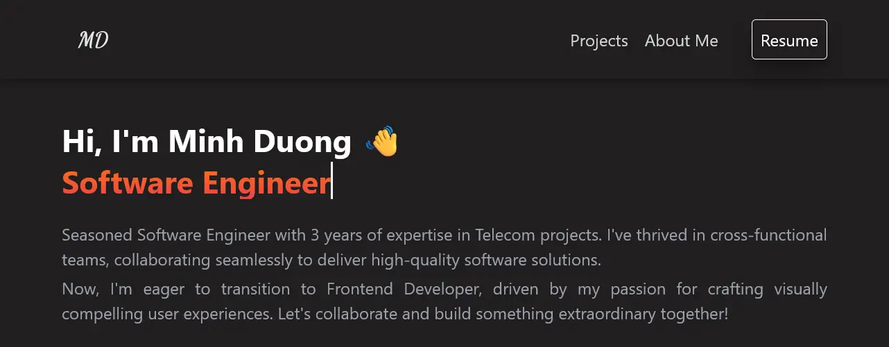

# Minh Duong's Portfolio



A responsive portfolio website built with React, TypeScript, and Firebase to showcase my projects and skills as a Frontend Developer.

## Table of Contents

- [Features](#features)
- [Technologies](#technologies)
- [Project Structure](#project-structure)
- [Setup and Installation](#setup-and-installation)
- [About Me](#about-me)
- [Contact](#contact)

## Features

- Responsive design that works on all devices
- Interactive UI with smooth scrolling
- Multilingual support (English/Vietnamese)
- Real-time project data from Firebase
- Dynamic skills showcase

## Technologies

- **Frontend**: React, TypeScript, TailwindCSS
- **State Management**: React Hooks
- **Backend/Database**: Firebase/Firestore
- **Deployment**: Vercel
- **Build Tool**: Vite

## Project Structure

The project follows a component-based architecture with a focus on reusability and separation of concerns:

### Core Directories

```
my-portfolio/
├── src/                    # Source files
│   ├── assets/             # Static assets (images, resume)
│   ├── components/         # React components
│   │   ├── common/         # Reusable UI components
│   │   ├── layout/         # Layout components (Header, Footer)
│   │   └── sections/       # Page section components
│   ├── hooks/              # Custom React hooks
│   ├── services/           # External services integration
│   │   └── firebase/       # Firebase configuration and services
│   ├── translations/       # Internationalization
│   │   └── languages/      # Language files (en.ts, vi.ts)
│   └── types/              # TypeScript type definitions
├── public/                 # Public assets
└── .env.example            # Environment variables template
```

### Key Components

- **App.tsx**: Main application component that orchestrates all sections
- **Layout Components**:
  - `Header.tsx`: Navigation and language switcher
  - `Footer.tsx`: Site footer with attribution
- **Section Components**:
  - `Banner.tsx`: Hero section with introduction
  - `Projects.tsx`: Portfolio projects showcase
  - `Skills.tsx`: Technical skills display
  - `AboutMe.tsx`: Career timeline and background
  - `Contact.tsx`: Contact information

### Data Flow

1. **Firebase Integration**: Real-time data retrieved via custom hooks (`useProjects`, `useSkills`)
2. **State Management**: React's useState and useEffect for local state management
3. **Translation System**:
   - `useTranslation` hook provides localized text
   - Translations stored in language-specific files
   - Language toggle affects entire application UI

### Styling

- TailwindCSS for responsive design
- Custom CSS for animations and special effects

## Setup and Installation

1. Clone the repository

```bash
git clone https://github.com/yourusername/my-portfolio.git
cd my-portfolio
```

2. Install dependencies

```bash
npm install
```

3. Create a `.env` file with your Firebase credentials based on `.env.example`

4. Run the development server

```bash
npm run dev
```

5. Build for production

```bash
npm run build
```

## About Me

Seasoned Software Engineer with 3 years of expertise in Telecom projects. I've thrived in cross-functional teams, collaborating seamlessly to deliver high-quality software solutions. Now, I'm eager to transition to Frontend Developer, driven by my passion for crafting visually compelling user experiences. Let's collaborate and build something extraordinary together!

## Contact

Feel free to reach out for collaborations, inquiries, or just to say hello. You can find me at:

- **Email**: johncegom2013@gmail.com
- **LinkedIn**: [Minh Duong](https://www.linkedin.com/in/minh-duong-saiko/)
- **Portfolio**: [https://minhduong.vercel.app/](https://minhduong.vercel.app/)

Thank you for visiting! Let's connect and create something extraordinary together.
